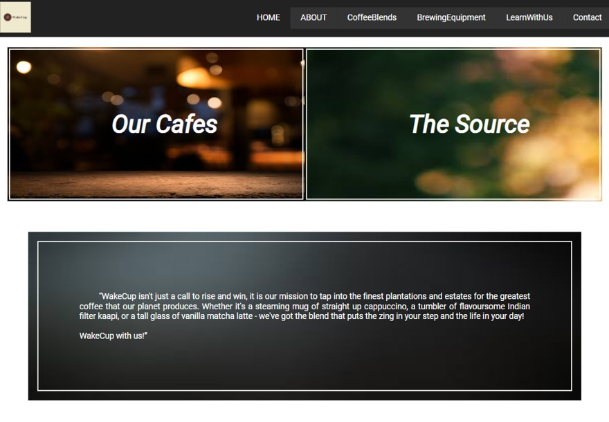
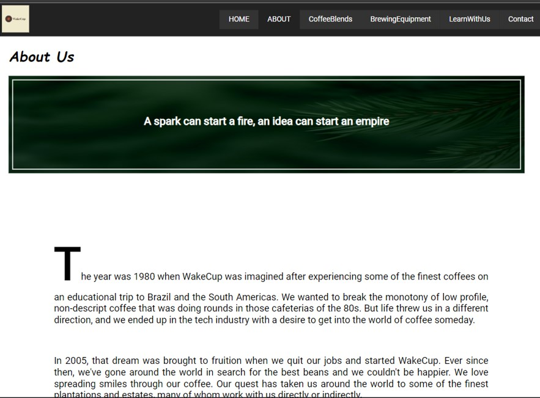
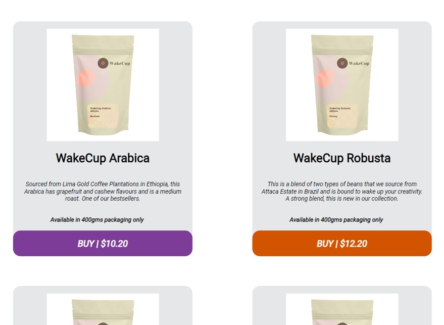
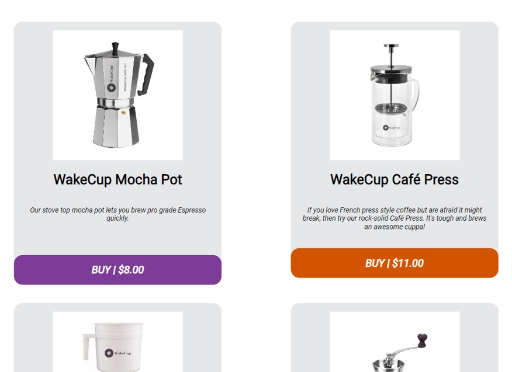
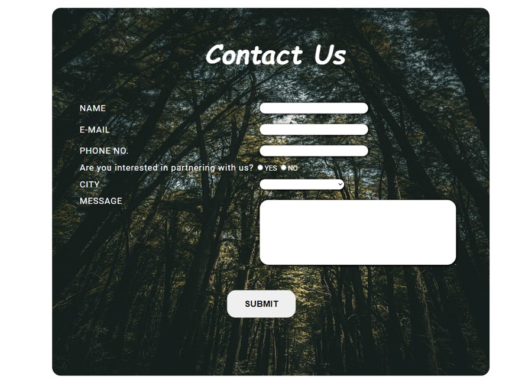

# Coffee-Marketplace-Workshop-Website

Overview
Welcome to the Coffee Marketplace & Workshop Website repository! This project contains an HTML website template crafted using HTML, CSS, and JavaScript, designed for selling coffee beans, coffee machines, and offering workshops for teaching coffee making. The website provides a comprehensive platform for coffee enthusiasts to explore, purchase, and learn about coffee.

Features
Product Listings: The website features a curated selection of coffee beans, coffee machines, and accessories, with detailed descriptions, images, and pricing to inform and entice customers.
Workshop Listings: Offer workshops, classes, or events focused on coffee making techniques, brewing methods, and coffee tasting, allowing users to browse schedules, descriptions, and registration details.
E-commerce Functionality: Implement e-commerce functionality to enable users to add coffee products to their shopping carts, make purchases securely, and track order status.
Booking System: Integrate a booking system for workshops, allowing users to reserve spots, make payments, and receive confirmation for their participation.
User Authentication: Implement user authentication functionality to enable account creation, login, and profile management for customers and workshop attendees.
Responsive Design: The website is designed to be responsive, ensuring optimal viewing and functionality across various devices and screen sizes.
Custom Styling: CSS is used to style the website, ensuring a visually appealing and cohesive design that aligns with your branding.

Usage
Clone the repository to your local machine.
Open the home.html file in a web browser to view the Coffee Marketplace & Workshop Website.
Customize the page layout, styling, and functionality in the HTML, CSS, and JavaScript files to suit your specific requirements.
Test the website thoroughly to ensure functionality, usability, and compatibility across different browsers and devices.
Populate the website with coffee products, workshop listings, and other relevant content to provide a compelling user experience.
Integrate e-commerce and booking functionality into your website using JavaScript or backend technologies as needed.
Launch the Coffee Marketplace & Workshop Website and promote it through social media, email marketing, and other channels to attract customers and workshop attendees.

